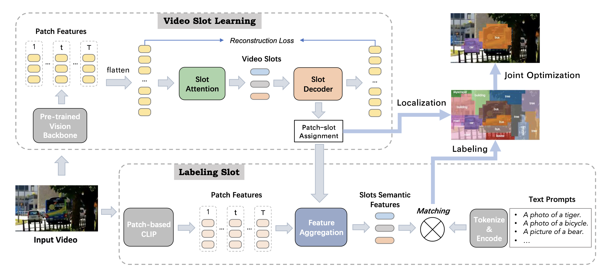

# Unsupervised Open-Vocabulary Object Localization in Videos

This codebase is the official implementation of [Unsupervised Open-Vocabulary Object Localization in Videos](https://openaccess.thecvf.com/content/ICCV2023/html/Fan_Unsupervised_Open-Vocabulary_Object_Localization_in_Videos_ICCV_2023_paper.html).

Arxiv Version:[Link](https://arxiv.org/abs/2309.09858)


## Introduction

We propose an unsupervised video object localization method that first localizes objects in videos via a slot attention approach and then assigns text to the obtained slots. The latter is achieved by an unsupervised way to read localized semantic information from the pre-trained CLIP model. The resulting video object localization is entirely unsupervised apart from the implicit annotation contained in CLIP. 

## Installation

This codebase is tested under PyTorch 1.11.0. You can config your PyTorch according to your machine and CUDA.

```
git clone git@github.com:amazon-science/object-centric-vol.git
cd object-centric-vol
conda create --name OV-VOL -y python=3.9
source activate OV-VOL
conda install ipython pip
conda install pytorch=1.11.0 torchvision cudatoolkit=10.0 -c pytorch
pip install -r requirements.txt
git clone git@github.com:MCG-NJU/VideoMAE.git
DS_BUILD_OPS=1 pip install deepspeed
```

## Data Preparation
Download ImageNet 2012 for training the patch-based CLIP and ILSVRC2015 VID dataset(ImageNet-VID) for video object localization.

After download and unzip the ImageNet-VID, you will get the folder with the following structures:
```
ILSVRC/
├── Annotations/
│   └── VID
│       ├── train
│       └── val
├── Data
│   └── VID
│       ├── snippets
│       ├── test
│       ├── train
│       └── val
└── ImageSets
    ├── VID
    └── VID_val_videos.txt
```
Use the following code to resize the original video to video with short edge 224 and both the height and width could be divided by 16.

```
python data/resize_short_bar_resize_patch.py /home/ubuntu/ILSVRC/Data/VID/snippets/train /home/ubuntu/ILSVRC2015_224px/train  --dense --level 2 --ext mp4 --to-mp4 --scale 224 --num-worker 2
python data/resize_short_bar_resize_patch.py /home/ubuntu/ILSVRC/Data/VID/snippets/test /home/ubuntu/ILSVRC2015_224px/test  --dense --level 1 --ext mp4 --to-mp4 --scale 224 --num-worker 2
python data/resize_short_bar_resize_patch.py /home/ubuntu/ILSVRC/Data/VID/snippets/val /home/ubuntu/ILSVRC2015_224px/val  --dense --level 1 --ext mp4 --to-mp4 --scale 224 --num-worker 2
```

Please place the dataset in the following structure:
```
code_root/
└── data_ckpt_logs/
    ├── ckpt
    ├── dataset
    │   ├── ILSVRC2015_224px
    │   │       ├── train
    │   │       ├── test
    │   │       └── val
    │   └── ILSVRC
    │           ├── Annotations
    │           │   └── VID
    │           │       ├── train
    │           │       └── val
    │           ├── Data
    │           │   └── VID
    │           │       ├── snippets
    │           │       ├── test
    │           │       ├── train
    │           │       └── val
    │           └── ImageSets
    │               ├── VID
    │               └── VID_val_videos.txt
    └── logs
```
We recommend you to use symbol link ``ln``.
Finally run the following code to generate the csv file for training the slot attention model
```
python generate_csv.py
```
Or you can download the generated list [here]()
## Training and Evaluation
### Pretraining the VideoMAE
```bash
YOUR_PATH=data_ckpt_logs
OUTPUT_DIR=${YOUR_PATH}/ckpt/pretrain-backbones
DATA_PATH=path-to-the-pretraining-video-list

OMP_NUM_THREADS=1 python -m torch.distributed.launch --nproc_per_node=8 \
        --master_port 12320 --nnodes=16 --node_rank=number-of-rank --master_addr=master-ip-addr \
        /home/ubuntu/GitLab/Object-Centric-VOL/run_mae_pretraining_single_frame.py \
        --data_path ${DATA_PATH} \
        --mask_type tube \
        --mask_ratio 0.9 \
        --model pretrain_videomae_base_patch16_224 \
        --decoder_depth 4 \
        --batch_size 4 \
        --num_frames 16 \
        --sampling_rate 2 \
        --opt adamw \
        --opt_betas 0.9 0.95 \
        --warmup_epochs 40 \
        --save_ckpt_freq 20 \
        --epochs 2401 \
        --log_dir ${OUTPUT_DIR} \
        --output_dir ${OUTPUT_DIR}
```

### Training the patch-based CLIP
run the following codes to train the patch-based CLIP
```bash
python train.py --dist-url 'tcp://IP_OF_NODE0:FREEPORT' \
  --dist-backend 'nccl' \
  --multiprocessing-distributed \
  --world-size 4 \
  --rank the-rank-of-your-machine \
  --data path-to-your-imagenet \
  --epochs 200 \
  --lr 1.0 \
  --batch-size 4096
```

### Train the slot attention grouping model on ImageNet-VID dataset
Then run the following codes to train the slot attention grouping after self-supervised pretraining
```bash
torchrun --nnodes=4 --node_rank 0 --master_addr ip-of-your-first-machine \
--master_port 8899 --nproc_per_node=8 ./train_grouping_imagenet_vid.py --pretrained_checkpint path-to-pretrained-backbone-checkpoint
torchrun --nnodes=4 --node_rank 1 --master_addr ip-of-your-first-machine \
--master_port 8899 --nproc_per_node=8 ./train_grouping_imagenet_vid.py --pretrained_checkpint path-to-pretrained-backbone-checkpoint
torchrun --nnodes=4 --node_rank 2 --master_addr ip-of-your-first-machine \
--master_port 8899 --nproc_per_node=8 ./train_grouping_imagenet_vid.py --pretrained_checkpint path-to-pretrained-backbone-checkpoint
torchrun --nnodes=4 --node_rank 3 --master_addr ip-of-your-first-machine \
--master_port 8899 --nproc_per_node=8 ./train_grouping_imagenet_vid.py --pretrained_checkpint path-to-pretrained-backbone-checkpoint
```

### Evaluation
After you trained the slot attention grouping model and patch-based clip, please use the following codes to eval the model:
```bash
torchrun --nnodes=1 --nproc_per_node=8 test_imagenet_vid.py \
  --st_grouping_ckpt_path --path-to-slot-attention-grouping-checkpoint \
  --clip_pacl_ckpt_path path-to-patch-based-clip-checkpoint \
  --num_slots 15 --n_stmae_seeds 1 \
  --seed 287 \
  --output_folder evaluation_results/VideoMAE_STGrouping_15slots_8frames_299epoch
```

## Checkpoints
We will add the checkpoint soon.

## Citation
If you find our paper useful for your research and applications, please cite using this BibTeX:
```bibtex
@InProceedings{Fan_2023_ICCV,
    author    = {Fan, Ke and Bai, Zechen and Xiao, Tianjun and Zietlow, Dominik and Horn, Max and Zhao, Zixu and Simon-Gabriel, Carl-Johann and Shou, Mike Zheng and Locatello, Francesco and Schiele, Bernt and Brox, Thomas and Zhang, Zheng and Fu, Yanwei and He, Tong},
    title     = {Unsupervised Open-Vocabulary Object Localization in Videos},
    booktitle = {Proceedings of the IEEE/CVF International Conference on Computer Vision (ICCV)},
    month     = {October},
    year      = {2023},
    pages     = {13747-13755}
}
```

## Security

See [CONTRIBUTING](CONTRIBUTING.md#security-issue-notifications) for more information.

## License

This project is licensed under the Apache-2.0 License.

